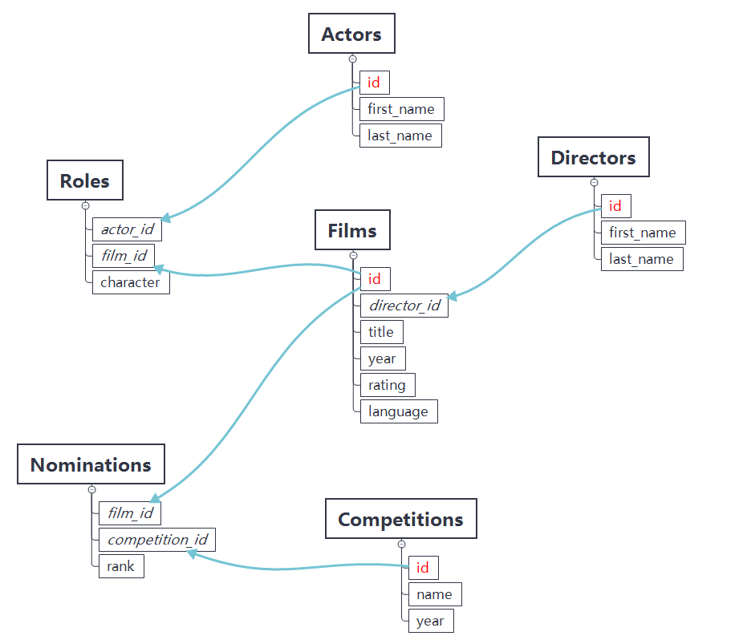
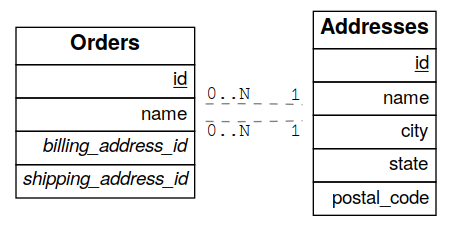

Tables and Views
================

All views and tables in the exposed schema and accessible by the active
database role for a request are available for querying. They are exposed
in one-level deep routes. For instance the full contents of a table
people is returned at

    GET /people HTTP/1.1

There are no deeply/nested/routes. Each route provides OPTIONS, GET,
HEAD, POST, PATCH, and DELETE verbs depending entirely on database
permissions.

Note

Why not provide nested routes? Many APIs allow nesting to retrieve
related information, such as `/films/1/director`. We offer a more
flexible mechanism (inspired by GraphQL) to embed related information.
It can handle one-to-many and many-to-many relationships. This is
covered in the section about `resource_embedding`.

Horizontal Filtering (Rows)
---------------------------

You can filter result rows by adding conditions on columns, each
condition a query string parameter. For instance, to return people aged
under 13 years old:

    GET /people?age=lt.13 HTTP/1.1

Multiple parameters can be logically conjoined by:

    GET /people?age=gte.18&student=is.true HTTP/1.1

Multiple parameters can be logically disjoined by:

    GET /people?or=(age.gte.14,age.lte.18) HTTP/1.1

Complex logic can also be applied:

    GET /people?and=(grade.gte.90,student.is.true,or(age.gte.14,age.is.null)) HTTP/1.1

### Operators

These operators are available:

<table>
<thead>
<tr class="header">
<th>Abbreviation</th>
<th>In PostgreSQL</th>
<th>Meaning</th>
</tr>
</thead>
<tbody>
<tr class="odd">
<td>eq</td>
<td><code>=</code></td>
<td>equals</td>
</tr>
<tr class="even">
<td>gt</td>
<td><code>&gt;</code></td>
<td>greater than</td>
</tr>
<tr class="odd">
<td>gte</td>
<td><code>&gt;=</code></td>
<td>greater than or equal</td>
</tr>
<tr class="even">
<td>lt</td>
<td><code>&lt;</code></td>
<td>less than</td>
</tr>
<tr class="odd">
<td>lte</td>
<td><code>&lt;=</code></td>
<td>less than or equal</td>
</tr>
<tr class="even">
<td>neq</td>
<td><code>&lt;&gt;</code> or <code>!=</code></td>
<td>not equal</td>
</tr>
<tr class="odd">
<td>like</td>
<td><code>LIKE</code></td>
<td>LIKE operator (use * in place of %)</td>
</tr>
<tr class="even">
<td>ilike</td>
<td><code>ILIKE</code></td>
<td>ILIKE operator (use * in place of %)</td>
</tr>
<tr class="odd">
<td>
in
</td>
<td>
<code>IN</code>
</td>
<td>
one of a list of values, e.g. <code>?a=in.(1,2,3)</code> – also supports commas in quoted strings like <code>?a=in.("hi,there","yes,you")</code>
</td>
</tr>
<tr class="even">
<td>is</td>
<td><code>IS</code></td>
<td>checking for exact equality (null,true,false)</td>
</tr>
<tr class="odd">
<td>fts</td>
<td><code>@@</code></td>
<td><code class="interpreted-text" role="ref">fts</code> using to_tsquery</td>
</tr>
<tr class="even">
<td>plfts</td>
<td><code>@@</code></td>
<td><code class="interpreted-text" role="ref">fts</code> using plainto_tsquery</td>
</tr>
<tr class="odd">
<td>phfts</td>
<td><code>@@</code></td>
<td><code class="interpreted-text" role="ref">fts</code> using phraseto_tsquery</td>
</tr>
<tr class="even">
<td>wfts</td>
<td><code>@@</code></td>
<td><code class="interpreted-text" role="ref">fts</code> using websearch_to_tsquery</td>
</tr>
<tr class="odd">
<td>cs</td>
<td><code>@&gt;</code></td>
<td>contains e.g. <code>?tags=cs.{example, new}</code></td>
</tr>
<tr class="even">
<td>cd</td>
<td><code>&lt;@</code></td>
<td>contained in e.g. <code>?values=cd.{1,2,3}</code></td>
</tr>
<tr class="odd">
<td>
ov
</td>
<td>
<code>&amp;&amp;</code>
</td>
<td>
overlap (have points in common), e.g. <code>?period=ov.[2017-01-01,2017-06-30]</code> – also supports array types, use curly braces instead of square brackets e.g. :code: ?arr=ov.{1,3}
</td>
</tr>
<tr class="even">
<td>sl</td>
<td><code>&lt;&lt;</code></td>
<td>strictly left of, e.g. <code>?range=sl.(1,10)</code></td>
</tr>
<tr class="odd">
<td>sr</td>
<td><code>&gt;&gt;</code></td>
<td>strictly right of</td>
</tr>
<tr class="even">
<td>nxr</td>
<td><code>&amp;&lt;</code></td>
<td>does not extend to the right of, e.g. <code>?range=nxr.(1,10)</code></td>
</tr>
<tr class="odd">
<td>nxl</td>
<td><code>&amp;&gt;</code></td>
<td>does not extend to the left of</td>
</tr>
<tr class="even">
<td>adj</td>
<td><code>-|-</code></td>
<td>is adjacent to, e.g. <code>?range=adj.(1,10)</code></td>
</tr>
<tr class="odd">
<td>not</td>
<td><code>NOT</code></td>
<td>negates another operator, see below</td>
</tr>
</tbody>
</table>

To negate any operator, prefix it with `not` like `?a=not.eq.2` or
`?not.and=(a.gte.0,a.lte.100)` .

For more complicated filters you will have to create a new view in the
database, or use a stored procedure. For instance, here's a view to show
"today's stories" including possibly older pinned stories:

    CREATE VIEW fresh_stories AS
    SELECT *
      FROM stories
     WHERE pinned = true
        OR published > now() - interval '1 day'
    ORDER BY pinned DESC, published DESC;

The view will provide a new endpoint:

    GET /fresh_stories HTTP/1.1

Important

Views are invoked with the privileges of the view owner, much like
stored procedures with the `SECURITY DEFINER` option. When created by a
SUPERUSER role, all [row-level
security](https://www.postgresql.org/docs/current/static/ddl-rowsecurity.html)
will be bypassed unless a different, non-SUPERUSER owner is specified.

    -- Workaround:
    -- non-SUPERUSER role to be used as the owner of the views
    CREATE ROLE api_views_owner;
    -- alter the view owner so RLS can work normally
    ALTER VIEW sample_view OWNER TO api_views_owner;

### Full-Text Search

The `fts` filter mentioned above has a number of options to support
flexible textual queries, namely the choice of plain vs phrase search
and the language used for stemming. Suppose that `tsearch` is a table
with column `my_tsv`, of type
[tsvector](https://www.postgresql.org/docs/current/static/datatype-textsearch.html).
The following examples illustrate the possibilities.

    GET /tsearch?my_tsv=fts(french).amusant HTTP/1.1

    GET /tsearch?my_tsv=plfts.The%20Fat%20Cats HTTP/1.1

    GET /tsearch?my_tsv=not.phfts(english).The%20Fat%20Cats HTTP/1.1

    GET /tsearch?my_tsv=not.wfts(french).amusant HTTP/1.1

Using phrase search mode requires PostgreSQL of version at least 9.6 and
will raise an error in earlier versions of the database.

Using websearch\_to\_tsquery requires
PostgreSQL of version at least 11.0 and will raise an error in earlier
versions of the database.

Vertical Filtering (Columns)
----------------------------

When certain columns are wide (such as those holding binary data), it is
more efficient for the server to withhold them in a response. The client
can specify which columns are required using the `select` parameter.

    GET /people?select=first_name,age HTTP/1.1

    [
      {"first_name": "John", "age": 30},
      {"first_name": "Jane", "age": 20}
    ]

The default is `*`, meaning all columns. This value will become more
important below in `resource_embedding`.

### Renaming Columns

You can rename the columns by prefixing them with an alias followed by
the colon `:` operator.

    GET /people?select=fullName:full_name,birthDate:birth_date HTTP/1.1

    [
      {"fullName": "John Doe", "birthDate": "04/25/1988"},
      {"fullName": "Jane Doe", "birthDate": "01/12/1998"}
    ]

### Casting Columns

Casting the columns is possible by suffixing them with the double colon
`::` plus the desired type.

    GET /people?select=full_name,salary::text HTTP/1.1

    [
      {"full_name": "John Doe", "salary": "90000.00"},
      {"full_name": "Jane Doe", "salary": "120000.00"}
    ]

### JSON Columns

You can specify a path for a `json` or `jsonb` column using the arrow
operators(`->` or `->>`) as per the [PostgreSQL
docs](https://www.postgresql.org/docs/9.5/static/functions-json.html).

    GET /people?select=id,json_data->>blood_type,json_data->phones HTTP/1.1

    [
      { "id": 1, "blood_type": "A-", "phones": [{"country_code": "61", "number": "917-929-5745"}] },
      { "id": 2, "blood_type": "O+", "phones": [{"country_code": "43", "number": "512-446-4988"}, {"country_code": "43", "number": "213-891-5979"}] }
    ]

    GET /people?select=id,json_data->phones->0->>number HTTP/1.1

    [
      { "id": 1, "number": "917-929-5745"},
      { "id": 2, "number": "512-446-4988"}
    ]

This also works with filters:

    GET /people?select=id,json_data->blood_type&json_data->>blood_type=eq.A- HTTP/1.1

    [
      { "id": 1, "blood_type": "A-" },
      { "id": 3, "blood_type": "A-" },
      { "id": 7, "blood_type": "A-" }
    ]

Note that `->>` is used to compare `blood_type` as `text`. To compare
with an integer value use `->`:

    GET /people?select=id,json_data->age&json_data->age=gt.20 HTTP/1.1

    [
      { "id": 11, "age": 25 },
      { "id": 12, "age": 30 },
      { "id": 15, "age": 35 }
    ]

### Computed Columns

Filters may be applied to computed columns(**a.k.a. virtual columns**)
as well as actual table/view columns, even though the computed columns
will not appear in the output. For example, to search first and last
names at once we can create a computed column that will not appear in
the output but can be used in a filter:

    CREATE TABLE people (
      fname text,
      lname text
    );

    CREATE FUNCTION full_name(people) RETURNS text AS $$
      SELECT $1.fname || ' ' || $1.lname;
    $$ LANGUAGE SQL;

    -- (optional) add an index to speed up anticipated query
    CREATE INDEX people_full_name_idx ON people
      USING GIN (to_tsvector('english', full_name(people)));

A full-text search on the computed column:

    GET /people?full_name=fts.Beckett HTTP/1.1

As mentioned, computed columns do not appear in the output by default.
However you can include them by listing them in the vertical filtering
`select` param:

    GET /people?select=*,full_name HTTP/1.1

Important

Computed columns must be created under the `exposed schema <db-schema>`
to be used in this way.

Unicode support
---------------

PostgREST supports unicode in schemas, tables, columns and values. To
access a table with unicode name, use percent encoding.

To request this:

    GET /موارد HTTP/1.1

Do this:

    GET /%D9%85%D9%88%D8%A7%D8%B1%D8%AF HTTP/1.1

### Table / Columns with spaces

You can request table/columns with spaces in them by percent encoding
the spaces with `%20`:

    GET /Order%20Items?Unit%20Price=lt.200 HTTP/1.1

### Reserved characters

If filters include PostgREST reserved characters(`,`, `.`, `:`, `()`)
you'll have to surround them in percent encoded double quotes `%22` for
correct processing.

Here `Hebdon,John` and `Williams,Mary` are values.

    GET /employees?name=in.(%22Hebdon,John%22,%22Williams,Mary%22) HTTP/1.1

Here `information.cpe` is a column name.

    GET /vulnerabilities?%22information.cpe%22=like.*MS* HTTP/1.1

Note

Some http libraries might encode URLs automatically(e.g. `axios`). In
these cases you should use double quotes `""` directly instead of `%22`.

Ordering
--------

The reserved word `order` reorders the response rows. It uses a
comma-separated list of columns and directions:

    GET /people?order=age.desc,height.asc HTTP/1.1

If no direction is specified it defaults to ascending order:

    GET /people?order=age HTTP/1.1

If you care where nulls are sorted, add nullsfirst or nullslast:

    GET /people?order=age.nullsfirst HTTP/1.1

    GET /people?order=age.desc.nullslast HTTP/1.1

You can also use `computed_cols` to order the results, even though the
computed columns will not appear in the output.

Limits and Pagination
---------------------

PostgREST uses HTTP range headers to describe the size of results. Every
response contains the current range and, if requested, the total number
of results:

    HTTP/1.1 200 OK
    Range-Unit: items
    Content-Range: 0-14/*

Here items zero through fourteen are returned. This information is
available in every response and can help you render pagination controls
on the client. This is an RFC7233-compliant solution that keeps the
response JSON cleaner.

There are two ways to apply a limit and offset rows: through request
headers or query params. When using headers you specify the range of
rows desired. This request gets the first twenty people.

    GET /people HTTP/1.1
    Range-Unit: items
    Range: 0-19

Note that the server may respond with fewer if unable to meet your
request:

    HTTP/1.1 200 OK
    Range-Unit: items
    Content-Range: 0-17/*

You may also request open-ended ranges for an offset with no limit, e.g.
`Range: 10-`.

The other way to request a limit or offset is with query parameters. For
example

    GET /people?limit=15&offset=30 HTTP/1.1

This method is also useful for embedded resources, which we will cover
in another section. The server always responds with range headers even
if you use query parameters to limit the query.

### Exact Count

In order to obtain the total size of the table or view (such as when
rendering the last page link in a pagination control), specify
`Prefer: count=exact` as a request header:

    HEAD /bigtable HTTP/1.1
    Range-Unit: items
    Range: 0-24
    Prefer: count=exact

Note that the larger the table the slower this query runs in the
database. The server will respond with the selected range and total

    HTTP/1.1 206 Partial Content
    Range-Unit: items
    Content-Range: 0-24/3573458

### Planned Count

To avoid the shortcomings of `exact count <exact_count>`, PostgREST can
leverage PostgreSQL statistics and get a fairly accurate and fast count.
To do this, specify the `Prefer: count=planned` header.

    HEAD /bigtable?limit=25 HTTP/1.1
    Prefer: count=planned

    HTTP/1.1 206 Partial Content
    Content-Range: 0-24/3572000

Note that the accuracy of this count depends on how up-to-date are the
PostgreSQL statistics tables. For example in this case, to increase the
accuracy of the count you can do `ANALYZE bigtable`. See
[ANALYZE](https://www.postgresql.org/docs/11/sql-analyze.html) for more
details.

### Estimated Count

When you are interested in the count, the relative error is important.
If you have a `planned count <planned_count>` of 1000000 and the exact
count is 1001000, the error is small enough to be ignored. But with a
planned count of 7, an exact count of 28 would be a huge misprediction.

In general, when having smaller row-counts, the estimated count should
be as close to the exact count as possible.

To help with these cases, PostgREST can get the exact count up until a
threshold and get the planned count when that threshold is surpassed. To
use this behavior, you can specify the `Prefer: count=estimated` header.
The **threshold** is defined by `max-rows`.

Here's an example. Suppose we set `max-rows=1000` and *smalltable* has
321 rows, then we'll get the exact count:

    HEAD /smalltable?limit=25 HTTP/1.1
    Prefer: count=estimated

    HTTP/1.1 206 Partial Content
    Content-Range: 0-24/321

If we make a similar request on *bigtable*, which has 3573458 rows, we
would get the planned count:

    HEAD /bigtable?limit=25 HTTP/1.1
    Prefer: count=estimated

    HTTP/1.1 206 Partial Content
    Content-Range: 0-24/3572000

Response Format
---------------

PostgREST uses proper HTTP content negotiation
([RFC7231](https://tools.ietf.org/html/rfc7231#section-5.3)) to deliver
the desired representation of a resource. That is to say the same API
endpoint can respond in different formats like JSON or CSV depending on
the client request.

Use the Accept request header to specify the acceptable format (or
formats) for the response:

    GET /people HTTP/1.1
    Accept: application/json

The current possibilities are

-   \*/\*
-   text/csv
-   application/json
-   application/openapi+json
-   application/octet-stream

The server will default to JSON for API endpoints and OpenAPI on the
root.

Singular or Plural
------------------

By default PostgREST returns all JSON results in an array, even when
there is only one item. For example, requesting `/items?id=eq.1` returns

    [
      { "id": 1 }
    ]

This can be inconvenient for client code. To return the first result as
an object unenclosed by an array, specify `vnd.pgrst.object` as part of
the `Accept` header

    GET /items?id=eq.1 HTTP/1.1
    Accept: application/vnd.pgrst.object+json

This returns

    { "id": 1 }

When a singular response is requested but no entries are found, the
server responds with an error message and 406 Not Acceptable status code
rather than the usual empty array and 200 status:

    {
      "message": "JSON object requested, multiple (or no) rows returned",
      "details": "Results contain 0 rows, application/vnd.pgrst.object+json requires 1 row"
    }

Note

Many APIs distinguish plural and singular resources using a special
nested URL convention e.g. /stories vs
/stories/1. Why do we use /stories?id=eq.1? The answer is because a
singular resource is (for us) a row determined by a primary key, and
primary keys can be compound (meaning defined across more than one
column). The more familiar nested urls consider only a degenerate case
of simple and overwhelmingly numeric primary keys. These so-called
artificial keys are often introduced automatically by Object Relational
Mapping libraries.

Admittedly PostgREST could detect when there is an equality condition
holding on all columns constituting the primary key and automatically
convert to singular. However this could lead to a surprising change of
format that breaks unwary client code just by filtering on an extra
column. Instead we allow manually specifying singular vs plural to
decouple that choice from the URL format.

Resource Embedding
==================

In addition to providing RESTful routes for each table and view,
PostgREST allows related resources to be included together in a single
API call. This reduces the need for multiple API requests. The server
uses **foreign keys** to determine which tables and views can be
returned together. For example, consider a database of films and their
awards:

Important

PostgREST needs [FOREIGN KEY
constraints](https://www.postgresql.org/docs/current/tutorial-fk.html)
to be able to do Resource Embedding.

As seen above in `v_filter` we can request the titles of all films like
this:

    GET /films?select=title HTTP/1.1

This might return something like

    [
      { "title": "Workers Leaving The Lumière Factory In Lyon" },
      { "title": "The Dickson Experimental Sound Film" },
      { "title": "The Haunted Castle" }
    ]

However because a foreign key constraint exists between Films and
Directors, we can request this information be included:

    GET /films?select=title,directors(id,last_name) HTTP/1.1

Which would return

    [
      { "title": "Workers Leaving The Lumière Factory In Lyon",
        "directors": {
          "id": 2,
          "last_name": "Lumière"
        }
      },
      { "title": "The Dickson Experimental Sound Film",
        "directors": {
          "id": 1,
          "last_name": "Dickson"
        }
      },
      { "title": "The Haunted Castle",
        "directors": {
          "id": 3,
          "last_name": "Méliès"
        }
      }
    ]

In this example, since the relationship is a forward relationship, there
is only one director associated with a film. As the table name is plural
it might be preferable for it to be singular instead. An table name
alias can accomplish this:

    GET /films?select=title,director:directors(id,last_name) HTTP/1.1

Important

Whenever FOREIGN KEY constraints change in the database schema you must
refresh PostgREST's schema cache for Resource Embedding to work
properly. See the section `schema_reloading`.

Embedding through join tables
-----------------------------

PostgREST can also detect relationships going through join tables. Thus
you can request the Actors for Films (which in this case finds the
information through Roles).

    GET /actors?select=films(title,year) HTTP/1.1

Embedded Filters
----------------

Embedded resources can be shaped similarly to their top-level
counterparts. To do so, prefix the query parameters with the name of the
embedded resource. For instance, to order the actors in each film:

    GET /films?select=*,actors(*)&actors.order=last_name,first_name HTTP/1.1

This sorts the list of actors in each film but does *not* change the
order of the films themselves. To filter the roles returned with each
film:

    GET /films?select=*,roles(*)&roles.character=in.(Chico,Harpo,Groucho) HTTP/1.1

Once again, this restricts the roles included to certain characters but
does not filter the films in any way. Films without any of those
characters would be included along with empty character lists.

An `or` filter can be used for a similar operation:

    GET /films?select=*,roles(*)&roles.or=(character.eq.Gummo,character.eq.Zeppo) HTTP/1.1

Limit and offset operations are possible:

    GET /films?select=*,actors(*)&actors.limit=10&actors.offset=2 HTTP/1.1

Embedded resources can be aliased and filters can be applied on these
aliases:

    GET /films?select=*,90_comps:competitions(name),91_comps:competitions(name)&90_comps.year=eq.1990&91_comps.year=eq.1991 HTTP/1.1

Embedding Views
---------------

Embedding a view is possible if the view contains columns that have
**foreign keys** defined in their source tables.

As an example, let's create a view called `nominations_view` based on
the *nominations* table.

    CREATE VIEW nominations_view AS
    SELECT
       rank
     , competition_id
     , film_id
    FROM
      nominations;

Since it contains `competition_id` and `film_id`—and each one has a
**foreign key** defined in its source table—we can embed *competitions*
and *films*:

    GET /nominations_view?select=rank,competitions(name,year),films(title)&rank=eq.5 HTTP/1.1

It's also possible to embed [Materialized
Views](https://www.postgresql.org/docs/11/rules-materializedviews.html).

Warning

It's not guaranteed that all kinds of views will be embeddable. In
particular, views that contain UNIONs will not be made embeddable.

Why? PostgREST detects source table foreign keys in the view by querying
and parsing
[pg\_rewrite](https://www.postgresql.org/docs/11/catalog-pg-rewrite.html).
This may fail depending on the complexity of the view.

[Report an issue](https://github.com/PostgREST/postgrest/issues) if your
view is not made embeddable so we can keep continue improving foreign
key detection.

In the future we'll include a way to manually specify views source
foreign keys to address this limitation.

Important

If view definitions change you must refresh PostgREST's schema cache for
this to work properly. See the section `schema_reloading`.

Embedding on Stored Procedures
------------------------------

If you have a `Stored Procedure <s_procs>` that returns a table type,
you can embed its related resources.

Here's a sample function(notice the `RETURNS SETOF films`).

    CREATE FUNCTION getallfilms() RETURNS SETOF films AS $$
      SELECT * FROM films;
    $$ LANGUAGE SQL IMMUTABLE;

A request with `directors` embedded:

    GET /rpc/getallfilms?select=title,directors(id,last_name)&title=like.*Workers* HTTP/1.1

    [
      { "title": "Workers Leaving The Lumière Factory In Lyon",
        "directors": {
          "id": 2,
          "last_name": "Lumière"
        }
      }
    ]

Embedding after Insertions/Updates/Deletions
--------------------------------------------

You can embed related resources after doing `insert_update` or `delete`.

Say you want to insert a **film** and then get some of its attributes
plus embed its **director**.

    POST /films?select=title,year,director:directors(first_name,last_name) HTTP/1.1
    Prefer: return=representation

    {
     "id": 100, "director_id": 40,
     "title": "127 hours", "year": 2010,
     "rating": 7.6, "language": "english"
    }

Response:

    {
     "title": "127 hours",
     "year": 2010,
     "director": {
       "first_name": "Danny",
       "last_name": "Boyle"
     }
    }

Embedding Disambiguation
------------------------

For doing resource embedding, PostgREST infers the relationship between
two tables based on a foreign key between them. However, in cases where
there's more than one foreign key between two tables, it's not possible
to infer the relationship unambiguosly by just specifying the tables
names.

### Target Disambiguation

For example, suppose you have the following `orders` and `addresses`
tables:

And you try to embed `orders` with `addresses` (this is the **target**):

    GET /orders?select=*,addresses(*) HTTP/1.1

Since the `orders` table has two foreign keys to the `addresses` table —
an order has a billing address and a shipping address — the request is
ambiguous and PostgREST will respond with an error:

    HTTP/1.1 300 Multiple Choices

If this happens, you need to disambiguate the request by adding
precision to the **target**. Instead of the **table name**, you can
specify the **foreign key constraint name** or the **column name** that
is part of the foreign key.

Let's try first with the **foreign key constraint name**. To make it
clearer we can name it:

    ALTER TABLE orders
       ADD CONSTRAINT billing_address  foreign key (billing_address_id) references addresses(id),
       ADD CONSTRAINT shipping_address foreign key (shipping_address_id) references addresses(id);

    -- Or if the constraints names were already generated by PostgreSQL we can rename them
    -- ALTER TABLE orders
    --   RENAME CONSTRAINT orders_billing_address_id_fkey  TO billing_address,
    --   RENAME CONSTRAINT orders_shipping_address_id_fkey TO shipping_address;

Now we can unambiguously embed the billing address by specifying the
`billing_address` foreign key constraint as the **target**.

    GET /orders?select=name,billing_address(name) HTTP/1.1

     [
      {
       "name": "Personal Water Filter",
       "billing_address": {
         "name": "32 Glenlake Dr.Dearborn, MI 48124"
       }
      }
     ]

Alternatively, you can specify the **column name** of the foreign key
constraint as the **target**. This can be aliased to make the result
more clear.

    GET /orders?select=name,billing_address:billing_address_id(name) HTTP/1.1

     [
      {
       "name": "Personal Water Filter",
       "billing_address": {
        "name": "32 Glenlake Dr.Dearborn, MI 48124"
       }
      }
     ]

### Hint Disambiguation

If specifying the **target** is not enough for unambiguous embedding,
you can add a **hint**. For example, let's assume we create two VIEWs of
`addresses`: `central_addresses` and `eastern_addresses`.

Since PostgREST supports `embedding_views` by detecting **source foreign
keys** in the views, embedding with the foreign key as the **target**
will not be enough for an unambiguous embed:

    GET /orders?select=*,billing_address(*) HTTP/1.1

    HTTP/1.1 300 Multiple Choices

For solving this case, in addition to the **target**, we can add a
**hint**. Here we specify `central_addresses` as the **target** and the
`billing_address` foreign key as the **hint**:

    GET /orders?select=*,central_addresses!billing_address(*) HTTP/1.1

    HTTP/1.1 200 OK

    [ ... ]

Similarly to the **target**, the **hint** can be a **table name**,
**foreign key constraint name** or **column name**.

Custom Queries
==============

The PostgREST URL grammar limits the kinds of queries clients can
perform. It prevents arbitrary, potentially poorly constructed and slow
client queries. It's good for quality of service, but means database
administrators must create custom views and stored procedures to provide
richer endpoints. The most common causes for custom endpoints are

-   Table unions
-   More complicated joins than those provided by [Resource
    Embedding](#resource-embedding)
-   Geo-spatial queries that require an argument, like "points near
    (lat,lon)"
-   More sophisticated full-text search than a simple use of the `fts`
    filter

Stored Procedures
=================

Every stored procedure in the API-exposed database schema is accessible
under the `/rpc` prefix. The API endpoint supports POST (and in some
cases GET) to execute the function.

    POST /rpc/function_name HTTP/1.1

Such functions can perform any operations allowed by PostgreSQL (read
data, modify data, and even DDL operations).

To supply arguments in an API call, include a JSON object in the request
payload and each key/value of the object will become an argument.

For instance, assume we have created this function in the database.

    CREATE FUNCTION add_them(a integer, b integer)
    RETURNS integer AS $$
     SELECT a + b;
    $$ LANGUAGE SQL IMMUTABLE;

The client can call it by posting an object like

    POST /rpc/add_them HTTP/1.1

    { "a": 1, "b": 2 }

    3

Important

Whenever you create or change a function you must refresh PostgREST's
schema cache. See the section `schema_reloading`.

If the schema cache is not refreshed, PostgREST will assume `text` as
the default type for function arguments. This could lead to getting
error responses like:

    {
     "hint":"No function matches the given name and argument types. You might need to add explicit type casts.",
     "details":null,
     "code":"42883",
     "message":"function test.add_them(a => text, b => text) does not exist"
    }

You can also call a function that takes a single parameter of type json
by sending the header `Prefer: params=single-object` with your request.
That way the JSON request body will be used as the single argument.

    CREATE FUNCTION mult_them(param json) RETURNS int AS $$
      SELECT (param->>'x')::int * (param->>'y')::int
    $$ LANGUAGE SQL;

    POST /rpc/mult_them HTTP/1.1
    Prefer: params=single-object

    { "x": 4, "y": 2 }

    8

Procedures must be declared with named parameters, procedures declared
like:

    CREATE FUNCTION non_named_args(integer, text, integer) ...

Can not be called with PostgREST, since we use [named
notation](https://www.postgresql.org/docs/current/static/sql-syntax-calling-funcs.html#SQL-SYNTAX-CALLING-FUNCS-NAMED)
internally.

Note that PostgreSQL converts identifier names to lowercase unless you
quote them like:

    CREATE FUNCTION "someFunc"("someParam" text) ...

PostgreSQL has four procedural languages that are part of the core
distribution: PL/pgSQL, PL/Tcl, PL/Perl, and PL/Python. There are many
other procedural languages distributed as additional extensions. Also,
plain SQL can be used to write functions (as shown in the example
above).

Note

For versions prior to PostgreSQL 10, to pass a PostgreSQL native array
you need to quote it as a string:

    POST /rpc/native_array_func HTTP/1.1

    { "arg": "{1,2,3}" }

In these versions we recommend using function arguments of type json to
accept arrays from the client:

    POST /rpc/json_array_func HTTP/1.1

    { "arg": [1,2,3] }

Starting from PostgreSQL 10, a json array from the client gets mapped
normally to a PostgreSQL native array.

Note

Why the /rpc prefix? One reason is to
avoid name collisions between views and procedures. It also helps
emphasize to API consumers that these functions are not normal restful
things. The functions can have arbitrary and surprising behavior, not
the standard "post creates a resource" thing that users expect from the
other routes.

Immutable and stable functions
------------------------------

Procedures in PostgreSQL marked with `stable` or `immutable`
[volatility](https://www.postgresql.org/docs/current/static/xfunc-volatility.html)
can only read, not modify, the database and PostgREST executes them in a
read-only transaction compatible for read-replicas. Stable and immutable
functions can be called with the HTTP GET verb if desired.

Note

The volatility marker is a promise about the behavior of the function.
PostgreSQL will let you mark a function that modifies the database as
`immutable/stable` without failure. However the function will fail when
called through PostgREST since it executes it in a read-only
transaction.

Because `add_them` was declared IMMUTABLE, we can alternately call the
function with a GET request:

    GET /rpc/add_them?a=1&b=2 HTTP/1.1

The function parameter names match the JSON object keys in the POST
case, for the GET case they match the query parameters `?a=1&b=2`.

Scalar functions
----------------

PostgREST will detect if the function is scalar or table-valued and will
shape the response format accordingly:

    GET /rpc/add_them?a=1&b=2 HTTP/1.1

    3

    GET /rpc/best_films_2017 HTTP/1.1

    [
      { "title": "Okja", "rating": 7.4},
      { "title": "Call me by your name", "rating": 8},
      { "title": "Blade Runner 2049", "rating": 8.1}
    ]

Bulk Call
---------

It's possible to call a function in a bulk way, analoguosly to
`bulk_insert`. To do this, you need to add the
`Prefer: params=multiple-objects` header to your request.

    POST /rpc/add_them HTTP/1.1
    Content-Type: application/json
    Prefer: params=multiple-objects

    [
       {"a": 1, "b": 2},
       {"a": 3, "b": 4}
    ]

Result:

    [ 3, 7 ]

It's also possible to `Specify Columns <specify_columns>` on functions
calls.

Function filters
----------------

A function that returns a table type response can be shaped using the
same filters as the ones used for tables and views:

    CREATE FUNCTION best_films_2017() RETURNS SETOF films ..

    GET /rpc/best_films_2017?select=title,director:directors(*) HTTP/1.1

    GET /rpc/best_films_2017?rating=gt.8&order=title.desc HTTP/1.1

Overloaded functions
--------------------

You can call overloaded functions with different number of arguments.

    CREATE FUNCTION rental_duration(customer_id integer) ..

    CREATE FUNCTION rental_duration(customer_id integer, from_date date) ..

    GET /rpc/rental_duration?customer_id=232 HTTP/1.1

    GET /rpc/rental_duration?customer_id=232&from_date=2018-07-01 HTTP/1.1

Insertions / Updates
====================

All tables and [auto-updatable
views](https://www.postgresql.org/docs/current/static/sql-createview.html#SQL-CREATEVIEW-UPDATABLE-VIEWS)
can be modified through the API, subject to permissions of the
requester's database role.

To create a row in a database table post a JSON object whose keys are
the names of the columns you would like to create. Missing properties
will be set to default values when applicable.

    POST /table_name HTTP/1.1

    { "col1": "value1", "col2": "value2" }

The response will include a `Location` header describing where to find
the new object. If the table is write-only then constructing the
Location header will cause a permissions error. To successfully insert
an item to a write-only table you will need to suppress the Location
response header by including the request header
`Prefer: return=minimal`.

On the other end of the spectrum you can get the full created object
back in the response to your request by including the header
`Prefer: return=representation`. That way you won't have to make another
HTTP call to discover properties that may have been filled in on the
server side. You can also apply the standard `v_filter` to these
results.

URL encoded payloads can be posted with
`Content-Type: application/x-www-form-urlencoded`.

    POST /people HTTP/1.1
    Content-Type: application/x-www-form-urlencoded

    name=John+Doe&age=50&weight=80

Note

When inserting a row you must post a JSON object, not quoted JSON.

    Yes
    { "a": 1, "b": 2 }

    No
    "{ \"a\": 1, \"b\": 2 }"

Some javascript libraries will post the data incorrectly if you're not
careful. For best results try one of the `clientside_libraries` built
for PostgREST.

To update a row or rows in a table, use the PATCH verb. Use `h_filter`
to specify which record(s) to update. Here is an example query setting
the `category` column to child for all people below a certain age.

    PATCH /people?age=lt.13 HTTP/1.1

    { "category": "child" }

Updates also support `Prefer: return=representation` plus `v_filter`.

Warning

Beware of accidentally updating every row in a table. To learn to
prevent that see `block_fulltable`.

Warning

Insertion on VIEWs with complex
[RULEs](https://www.postgresql.org/docs/11/sql-createrule.html) might
not work out of the box with PostgREST. It's recommended that you [use
triggers instead of
RULEs](https://wiki.postgresql.org/wiki/Don%27t_Do_This#Don.27t_use_rules).
If you want to keep using RULEs, a workaround is to wrap the VIEW
insertion in a stored procedure and call it through the `s_procs`
interface.

Bulk Insert
-----------

Bulk insert works exactly like single row insert except that you provide
either a JSON array of objects having uniform keys, or lines in CSV
format. This not only minimizes the HTTP requests required but uses a
single INSERT statement on the back-end for efficiency. Note that using
CSV requires less parsing on the server and is much faster.

To bulk insert CSV simply post to a table route with
`Content-Type: text/csv` and include the names of the columns as the
first row. For instance

    POST /people HTTP/1.1
    Content-Type: text/csv

    name,age,height
    J Doe,62,70
    Jonas,10,55

An empty field (`,,`) is coerced to an empty string and the reserved
word `NULL` is mapped to the SQL null value. Note that there should be
no spaces between the column names and commas.

To bulk insert JSON post an array of objects having all-matching keys

    POST /people HTTP/1.1
    Content-Type: application/json

    [
      { "name": "J Doe", "age": 62, "height": 70 },
      { "name": "Janus", "age": 10, "height": 55 }
    ]

Specifying Columns
------------------

By using the `columns` query parameter it's possible to specify the
payload keys that will be inserted/updated and ignore the rest of the
payload.

    POST /datasets?columns=source,publication_date,figure HTTP/1.1
    Content-Type: application/json

    {
      "source": "Natural Disaster Prevention and Control",
      "publication_date": "2015-09-11",
      "figure": 1100,
      "location": "...",
      "comment": "...",
      "extra": "...",
      "stuff": "..."
    }

In this case, only **source**, **publication\_date** and **figure** will
be inserted. The rest of the JSON keys will be ignored.

Using this also has the side-effect of being more efficient for
`bulk_insert` since PostgREST will not process the JSON and it'll send
it directly to PostgreSQL.

UPSERT
------

You can make an UPSERT with `POST` and the
`Prefer: resolution=merge-duplicates` header:

    POST /employees HTTP/1.1
    Prefer: resolution=merge-duplicates

    [
      { "id": 1, "name": "Old employee 1", "salary": 30000 },
      { "id": 2, "name": "Old employee 2", "salary": 42000 },
      { "id": 3, "name": "New employee 3", "salary": 50000 }
    ]

By default, UPSERT operates based on the primary key columns, you must
specify all of them. You can also choose to ignore the duplicates with
`Prefer: resolution=ignore-duplicates`. This works best when the primary
key is natural, but it's also possible to use it if the primary key is
surrogate (example: "id serial primary key"). For more details read
[this issue](https://github.com/PostgREST/postgrest/issues/1118).

Important

After creating a table or changing its primary key, you must refresh
PostgREST schema cache for UPSERT to work properly. To learn how to
refresh the cache see `schema_reloading`.

### On Conflict

By specifying the `on_conflict` query parameter, you can make UPSERT
work on a column(s) that has a UNIQUE constraint.

    POST /employees?on_conflict=name HTTP/1.1
    Prefer: resolution=merge-duplicates

    [
      { "name": "Old employee 1", "salary": 40000 },
      { "name": "Old employee 2", "salary": 52000 },
      { "name": "New employee 3", "salary": 60000 }
    ]

### PUT

A single row UPSERT can be done by using `PUT` and filtering the primary
key columns with `eq`:

    PUT /employees?id=eq.4 HTTP/1.1

    { "id": 4, "name": "Sara B.", "salary": 60000 }

All the columns must be specified in the request body, including the
primary key columns.

Note

Upsert features are only available starting from PostgreSQL 9.5 since it
uses the [ON CONFLICT
clause](https://www.postgresql.org/docs/9.5/static/sql-insert.html#SQL-ON-CONFLICT).

Deletions
=========

To delete rows in a table, use the DELETE verb plus `h_filter`. For
instance deleting inactive users:

    DELETE /user?active=is.false HTTP/1.1

Warning

Beware of accidentally deleting all rows in a table. To learn to prevent
that see `block_fulltable`.

Binary Output
=============

If you want to return raw binary data from a `bytea` column, you must
specify `application/octet-stream` as part of the `Accept` header and
select a single column `?select=bin_data`.

    GET /items?select=bin_data&id=eq.1 HTTP/1.1
    Accept: application/octet-stream

You can also request binary output when calling [Stored
Procedures](#stored-procedures) and since they can return a scalar value
you are not forced to use `select` for this case.

    CREATE FUNCTION closest_point(..) RETURNS bytea ..

    POST /rpc/closest_point HTTP/1.1
    Accept: application/octet-stream

If the stored procedure returns non-scalar values, you need to do a
`select` in the same way as for GET binary output.

    CREATE FUNCTION overlapping_regions(..) RETURNS SETOF TABLE(geom_twkb bytea, ..) ..

    POST /rpc/overlapping_regions?select=geom_twkb HTTP/1.1
    Accept: application/octet-stream

Note

If more than one row would be returned the binary results will be
concatenated with no delimiter.

Plain Text Output
-----------------

You can get raw output from a `text` column by using
`Accept: text/plain`.

    GET /workers?select=custom_psv_format HTTP/1.1
    Accept: text/plain

    09310817|JOHN|DOE|15/04/88|
    42152780|FRED|BLOGGS|20/02/85|
    43006541|OTTO|NORMALVERBRAUCHER|01/07/90|
    02452492|ERIKA|MUSTERMANN|11/01/80|

This follows the same rules as `binary_output`.

OpenAPI Support
===============

Every API hosted by PostgREST automatically serves a full
[OpenAPI](https://www.openapis.org/) description on the root path. This
provides a list of all endpoints(tables, foreign tables, views,
functions), along with supported HTTP verbs and example payloads. For
extra customization, the OpenAPI output contains a "description" field
for every [SQL
comment](https://www.postgresql.org/docs/current/static/sql-comment.html)
on any database object. For instance,

    COMMENT ON SCHEMA mammals IS
      'A warm-blooded vertebrate animal of a class that is distinguished by the secretion of milk by females for the nourishment of the young';

    COMMENT ON TABLE monotremes IS
      'Freakish mammals lay the best eggs for breakfast';

    COMMENT ON COLUMN monotremes.has_venomous_claw IS
      'Sometimes breakfast is not worth it';

These unsavory comments will appear in the generated JSON as the fields,
`info.description`, `definitions.monotremes.description` and
`definitions.monotremes.properties.has_venomous_claw.description`.

Also if you wish to generate a `summary` field you can do it by having a
multiple line comment, the `summary` will be the first line and the
`description` the lines that follow it:

    COMMENT ON TABLE entities IS
      $$Entities summary

      Entities description that
      spans
      multiple lines$$;

You can use a tool like [Swagger UI](http://swagger.io/swagger-ui/) to
create beautiful documentation from the description and to host an
interactive web-based dashboard. The dashboard allows developers to make
requests against a live PostgREST server, and provides guidance with
request headers and example request bodies.

Important

The OpenAPI information can go out of date as the schema changes under a
running server. To learn how to refresh the cache see
`schema_reloading`.

HTTP Logic
==========

Accessing Request Headers, Cookies and JWT claims
-------------------------------------------------

You can access request headers, cookies and jwt claims by reading GUC
variables set by PostgREST per request. They are named
`request.header.XYZ`, `request.cookie.XYZ` and `request.jwt.claim.XYZ`.

    -- To read the value of the Origin request header:
    SELECT current_setting('request.header.origin', true);
    -- To read the value of sessionId in a cookie:
    SELECT current_setting('request.cookie.sessionId', true);
    -- To read the value of the email claim in a jwt:
    SELECT current_setting('request.jwt.claim.email', true);

Note

`request.jwt.claim.role` defaults to the value of `db-anon-role`.

Accessing Request Path and Method
---------------------------------

You can also access the request path and method with `request.path` and
`request.method`.

    -- You can get the path of the request with
    SELECT current_setting('request.path', true);

    -- You can get the method of the request with
    SELECT current_setting('request.method', true);

Setting Response Headers
------------------------

PostgREST reads the `response.headers` SQL variable to add extra headers
to the HTTP response. Stored procedures can modify this variable. For
instance, this statement would add caching headers to the response:

    -- tell client to cache response for two days

    SET LOCAL "response.headers" =
      '[{"Cache-Control": "public"}, {"Cache-Control": "max-age=259200"}]';

Notice that the variable should be set to an *array* of single-key
objects rather than a single multiple-key object. This is because
headers such as `Cache-Control` or `Set-Cookie` need to be repeated when
setting multiple values and an object would not allow the repeated key.

Note

PostgREST provided headers such as `Content-Type`, `Location`, etc. can
be overriden this way.

Setting headers via pre-request
-------------------------------

By using a `pre-request` function, you can add headers to
GET/POST/PATCH/PUT/DELETE responses. As an example, let's add some cache
headers for all requests that come from an Internet Explorer(6 or 7)
browser.

    create or replace function custom_headers() returns void as $$
    declare
      user_agent text := current_setting('request.header.user-agent', true);
    begin
      if user_agent similar to '%MSIE (6.0|7.0)%' then
        perform set_config('response.headers',
          '[{"Cache-Control": "no-cache, no-store, must-revalidate"}]', false);
      end if;
    end; $$ language plpgsql;

    -- set this function on postgrest.conf
    -- pre-request = custom_headers

Now when you make a GET request to a table or view, you'll get the cache
headers.

    GET /people HTTP/1.1
    User-Agent: Mozilla/4.01 (compatible; MSIE 6.0; Windows NT 5.1)

    HTTP/1.1 200 OK
    Content-Type: application/json; charset=utf-8
    Cache-Control: no-cache, no-store, must-revalidate

    ...

Errors and HTTP Status Codes
----------------------------

Stored procedures can return non-200 HTTP status codes by raising SQL
exceptions. For instance, here's a saucy function that always responds
with an error:

    CREATE OR REPLACE FUNCTION just_fail() RETURNS void
      LANGUAGE plpgsql
      AS $$
    BEGIN
      RAISE EXCEPTION 'I refuse!'
        USING DETAIL = 'Pretty simple',
              HINT = 'There is nothing you can do.';
    END
    $$;

Calling the function returns HTTP 400 with the body

    {
      "message":"I refuse!",
      "details":"Pretty simple",
      "hint":"There is nothing you can do.",
      "code":"P0001"
    }

One way to customize the HTTP status code is by raising particular
exceptions according to the PostgREST
`error to status code mapping <status_codes>`. For example,
`RAISE insufficient_privilege` will respond with HTTP 401/403 as
appropriate.

For even greater control of the HTTP status code, raise an exception of
the `PTxyz` type. For instance to respond with HTTP 402, raise 'PT402':

    RAISE sqlstate 'PT402' using
      message = 'Payment Required',
      detail = 'Quota exceeded',
      hint = 'Upgrade your plan';

Returns:

    HTTP/1.1 402 Payment Required
    Content-Type: application/json; charset=utf-8

    {"hint":"Upgrade your plan","details":"Quota exceeded"}

HTTP Status Codes
-----------------

PostgREST translates [PostgreSQL error
codes](https://www.postgresql.org/docs/current/static/errcodes-appendix.html)
into HTTP status as follows:

<table>
<colgroup>
<col style="width: 31%" />
<col style="width: 29%" />
<col style="width: 39%" />
</colgroup>
<thead>
<tr class="header">
<th>PostgreSQL error code(s)</th>
<th>HTTP status</th>
<th>Error description</th>
</tr>
</thead>
<tbody>
<tr class="odd">
<td>08*</td>
<td>503</td>
<td>pg connection err</td>
</tr>
<tr class="even">
<td>09*</td>
<td>500</td>
<td>triggered action exception</td>
</tr>
<tr class="odd">
<td>0L*</td>
<td>403</td>
<td>invalid grantor</td>
</tr>
<tr class="even">
<td>0P*</td>
<td>403</td>
<td>invalid role specification</td>
</tr>
<tr class="odd">
<td>23503</td>
<td>409</td>
<td>foreign key violation</td>
</tr>
<tr class="even">
<td>23505</td>
<td>409</td>
<td>uniqueness violation</td>
</tr>
<tr class="odd">
<td>25*</td>
<td>500</td>
<td>invalid transaction state</td>
</tr>
<tr class="even">
<td>28*</td>
<td>403</td>
<td>invalid auth specification</td>
</tr>
<tr class="odd">
<td>2D*</td>
<td>500</td>
<td>invalid transaction termination</td>
</tr>
<tr class="even">
<td>38*</td>
<td>500</td>
<td>external routine exception</td>
</tr>
<tr class="odd">
<td>39*</td>
<td>500</td>
<td>external routine invocation</td>
</tr>
<tr class="even">
<td>3B*</td>
<td>500</td>
<td>savepoint exception</td>
</tr>
<tr class="odd">
<td>40*</td>
<td>500</td>
<td>transaction rollback</td>
</tr>
<tr class="even">
<td>53*</td>
<td>503</td>
<td>insufficient resources</td>
</tr>
<tr class="odd">
<td>54*</td>
<td>413</td>
<td>too complex</td>
</tr>
<tr class="even">
<td>55*</td>
<td>500</td>
<td>obj not in prerequisite state</td>
</tr>
<tr class="odd">
<td>57*</td>
<td>500</td>
<td>operator intervention</td>
</tr>
<tr class="even">
<td>58*</td>
<td>500</td>
<td>system error</td>
</tr>
<tr class="odd">
<td>F0*</td>
<td>500</td>
<td>conf file error</td>
</tr>
<tr class="even">
<td>HV*</td>
<td>500</td>
<td>foreign data wrapper error</td>
</tr>
<tr class="odd">
<td>P0001</td>
<td>400</td>
<td>default code for "raise"</td>
</tr>
<tr class="even">
<td>P0*</td>
<td>500</td>
<td>PL/pgSQL error</td>
</tr>
<tr class="odd">
<td>XX*</td>
<td>500</td>
<td>internal error</td>
</tr>
<tr class="even">
<td>42883</td>
<td>404</td>
<td>undefined function</td>
</tr>
<tr class="odd">
<td>42P01</td>
<td>404</td>
<td>undefined table</td>
</tr>
<tr class="even">
<td>42501</td>
<td>
if authenticated 403, 
else 401
</td>
<td>insufficient privileges</td>
</tr>
<tr class="odd">
<td>other</td>
<td>400</td>
<td></td>
</tr>
</tbody>
</table>
